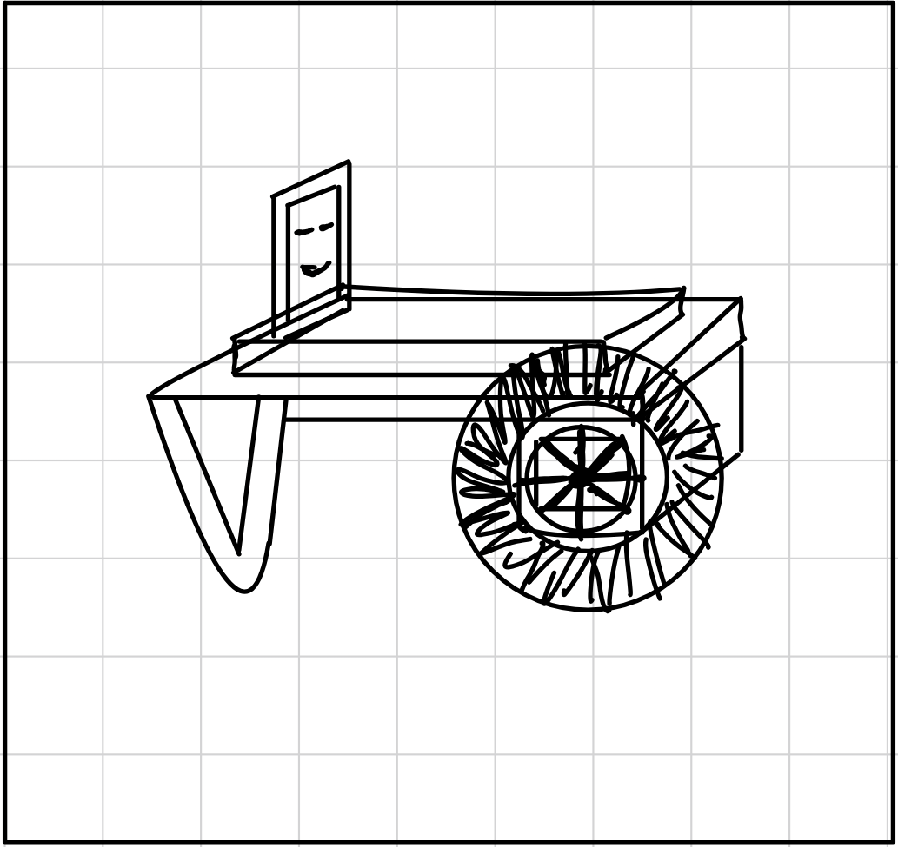

# Workshops: Let Plaiy

## Overview
These workshops introduce students to embedded programming and AI-based solutions using the micro:bit board, providing foundational knowledge of embedded systems.

## Hardware and Environment
The micro:bit board is used, supporting BLE, temperature sensing, gyroscope, light intensity, and distance measurement. Programming is done in Microsoft MakeCode.

## Workshop Details

### Cardboard Remote-Controlled Car

Create a remote-controlled car from cardboard, controlled via mobile devices.
- **Materials**: micro:bit, DF-Robot motor control board, 5V battery pack, rubber wheels, 360-degree servo motors.
- **Activities**: Assembly, basic programming with MakeCode.
- **Duration**: 3 hours
- **Age**: 10-12 years

### Ultrasonic Distance Warner

Build a digital distance warning system with an ultrasonic sensor.
- **Materials**: micro:bit, breadboard, ultrasonic sensor, OLED/LCD display, LED traffic light.
- **Activities**: Programming logic, hardware assembly.
- **Duration**: 3-4 hours
- **Age**: 11-13 years

### Plant Watering System

Construct an automated plant watering system.
- **Materials**: micro:bit, Rekabit control board, moisture sensor, water pump, servo motor, OLED display.
- **Activities**: Soil moisture detection, pump control, servo motor usage.
- **Duration**: 3-4 hours
- **Age**: 11-14 years

### Reaction Time Tester

Build and program a reaction time measuring device.
- **Materials**: micro:bit, A4 cardboard, tape, aluminum foil, crocodile clips.
- **Activities**: Algorithm creation, programming exercises.
- **Duration**: 3 hours
- **Age**: 11-13 years

### Rock-Paper-Scissors Wearable

Create a micro:bit wearable rock-paper-scissors game.
- **Materials**: micro:bit, cardboard/craft felt, adhesive pads, closures, decorative materials.
- **Activities**: Wearable creation, programming for game rules.
- **Duration**: 3 school hours
- **Age**: 10-12 years

### Possible Implementation

#### Cardboard Remote-Controlled Car

#### Ultrasonic Distance Warner

#### Plant Watering System

#### Reaction Time Tester

#### Rock-Paper-Scissors Wearable

## New Ideation 

### RoboCar

### H²O-Fountain

### Crash-Alarm

### Omnitrix

### SuperHome

## Additional Resources
- **Product Details**: [NRF52833-QIAA-B-R](https://www.mouser.de/ProductDetail/Nordic-Semiconductor/NRF52833-QIAA-B-R?qs=QNEnbhJQKvZJgEeQ4YvY6A%3D%3D&srsltid=AfmBOooqhyATLsEwSMoCtS5QGuVrmZizfp8Re_mR3uQiQ8FBH__UMQIP)
- **Datasheet**: [NRF52833-QIAA-B-R](https://www.mouser.de/datasheet/2/297/nRF52833_SoC_Product_Brief-1815256.pdf)
- **micro:bit Schematic**: [Schematic](https://tech.microbit.org/hardware/schematic/)
- **micro:bit Reference Design**: [Reference Design](https://tech.microbit.org/hardware/reference-design/)
- **GitHub**: [micro:bit Reference Design GitHub](https://github.com/microbit-foundation/microbit-reference-design)
- **code:bit Information**: [code:bit](https://tech.microbit.org/hardware/)
- **Maker Code**: Visit [Microsoft MakeCode](https://makecode.microbit.org/)
- **Workshop Wiki**: Detailed documents on our workshop's Wiki: [Workshop Material Wiki](https://wiki.eolab.de/doku.php?id=lets_plaiy:workshop-material:start)
