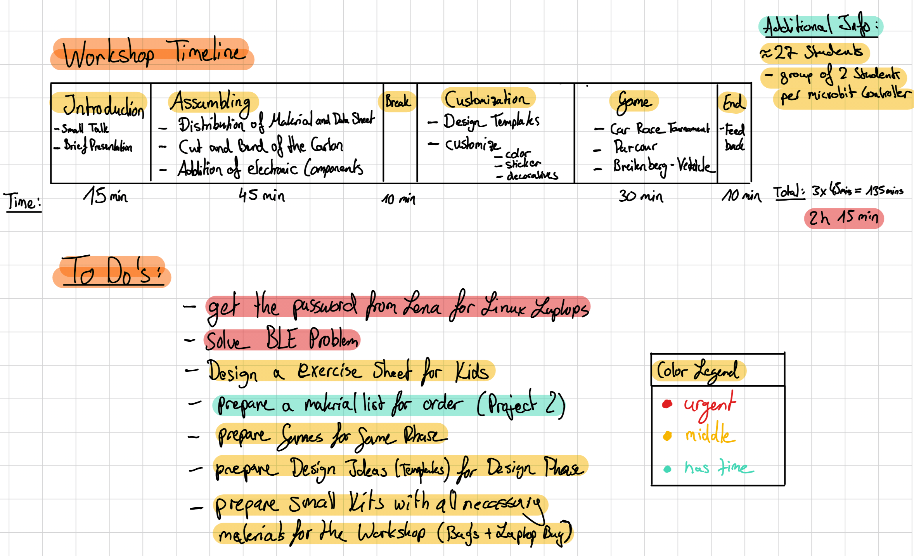

# Workshop: Lets Plaiy

## Main Goal
The main goal of the project is to provide children with a ready-to-use kit from which they can build the object without needing to program.

## General Conditions
1. Around 27 students (in pairs)
2. Duration: 3 hours

## Appointments

### 1)
**Contact Person:** Sabine Dückers  
**Appointment:** 02.06.25, 12:30  
**Location:**  
Hagelkreuz Schule  
Pantaleonstr. 13  
Xanten Lüttingen

### 2)
**Contact Person:** Frau Dr. Seidel  
**Appointment:**  
- 02.07.25, 13:30 (First Meeting)  
- 10.07.25, 9:50 (Workshop)  
**Location:**  
Georg Forster Gymnasium  
Moerser Str. 167  
47475 Kamp-Lintfort

### 3)
**Contact Person:** —  
**Appointment:** 30.07.25, 10:00–12:30  
**Location:** Vluyn

### 4a)
**Appointment:** Talent-Tage Ruhr  
**Location:** Essen  
**Date Range:** 22.09.25 – 02.10.25  

**Detailed Slots:**  
- 22.09.25: 9:00–11:00 | 11:30–13:30  
- 23.09.25: 9:00–11:00 | 11:30–13:30  
- 29.09.25: 9:00–11:00 | 11:30–13:30  
- 30.09.25: 9:00–11:00 | 11:30–13:30

## Procedure
- Small talk  
- Introduction round  
- Ask about prior experience  
- Introduction  
- Building phase  
- Play phase

4. 

##  To-Do List

01. ✅ Prepare the bags with the components  
02. ✅ Procure 15 PH1 screwdrivers. No longer necessary, the work was done at GFL  
03. ✅ Assemble equipment bags:  
  - 1x screwdriver  
  - 2x small cardboard separators  
  - 1x dfrobot microcontroller box (black)  
  - 1x small BBC micro:bit board  
  - 1x battery  
  - small paper bag for smaller components  
  - 2x wheel-motor complex  
  - some laminated instructions (A5)  
  - 1x report form (A4, folded)  
  - 4 rubber bands  
  - 4x pins  
04. ✅ Design report form and instruction sheets (to be laminated)  
05. 🟥 Find and distribute the parent letter  
06. ✅ The potentiometer screw can be turned with a flathead 0.3/1.8 screwdriver. The potentiometers were adjusted by the team prior to the school visits  
07. ✅ Buy A4 sticker paper for printing  
08. ✅ Buy decorative stickers/rhinestones for cars. Compare prices between discounter and office supply store  
09. ✅ Design stickers for printing  
10. ✅ Cut 60 cardboard pieces of 10x28 cm for the two other groups  
11. ✅ Book the Vito  
12. 🟥 Replace exhausted stickers (clouds, etc.)  
13. ✅ Procure thin cardboard to make spare chassis  
14. 🟥 Cut new chassis sections as spares  
15. ✅ Sort equipment and identify missing components  
16. 🟦 Restore the component bags as far as possible  
17. ✅ Rework the instructions: create a graphic instruction sheet and improve the construction guide  
18. ✅ Print and laminate new instructions  
19. 🟦 Collect images and videos from everyone's cameras  
20. 🟦 Design a certificate for the kids featuring a photo of their group and their car, as a memento of the workshop (pick Rolf’s brain)  
21. ✅ Prepare the GFL camera and procure an SD card  
22. 🟥 Attach a label to the micro:bit without a label, vagov  
23. 🟥 Configure the iPad before class (WLAN, Bluetooth)  
24. 🟦 Ensure the camera battery is charged  
25. ✅ Check with the Kamp-Lintfort school if tablets are available  
26. 🟥 Check with "pul im ex" if they are interested in supplying materials for small fountain constructions and various sizes of substrate for hydraulic models (in the context of TalentTage Ruhr in September)

